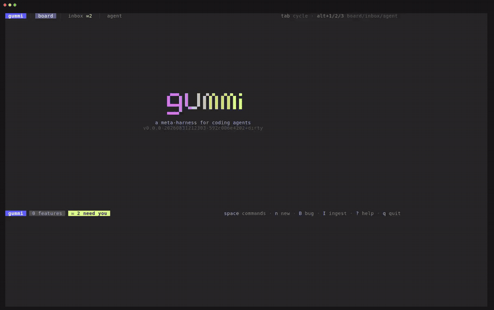

# gummi

> A meta-harness for coding agents. Drive a fleet of agents through a
> spec-driven workflow across git worktrees, from one TUI.



**The bottleneck in agentic coding isn't the agents anymore. It's you.**

One coding agent is a pair programmer. Five are a management problem:
a pile of terminals, worktrees you have to keep straight in your head,
and an agent that has been silently blocked on a question for the last
twenty minutes. Meanwhile every step burns frontier-model tokens whether
it needs frontier intelligence or not, and nothing stops an agent from
jumping straight to code without a spec or shipping unreviewed work.

gummi replaces the pile of terminals with one board. Every unit of work
is a card moving through a fixed workflow; every card gets its own git
worktree and branch; every stage is performed by an agent whose model
*you* choose. gummi's job ends at a **verified branch** — land it with
the built-in one-key squash-merge or however you like; PRs and releasing
stay in your hands.

## Three ideas

**You are the scarce resource.** gummi's parallelism is attention-based,
not throughput-based. By default one autonomous agent runs at a time
while the rest queue, and everything that needs a human — gates, agent
questions, failures, exhausted budgets — lands in a single
needs-attention inbox. The point isn't to run ten agents at once; it's
to make context-switching between features cheap and to never leave an
agent waiting on you without you knowing.

**The process is fixed; only the spend is yours to choose.** The
workflow is compiled in, never configurable: no implementation without
an approved spec, no merge without review and verification. The only
degrees of freedom are skip flags for the early design stages and
automatic rerun transitions (fix → re-review). Review and Verify can
never be skipped. You can't accidentally configure the quality floor
away, because there is no configuration.

**Frontier models only where they earn it.** Stages are performed by
*roles* (`architect`, `implementer`, `reviewer`, `scribe`), and a
*profile* maps roles to concrete models — a frontier model for design
and review, a cheap or local model for mechanical steps. Each feature
carries a credit envelope every stage draws from, with a human top-up
gate when it runs dry. Same process every time; spend chosen per
feature.

## The workflow

Two kinds of work item share the machinery:

```
feature  FD-NNN   todo → brainstorm → spec → plan → implement → review → verify → done
bug      BG-NNN   todo → triage → diagnose → fix ──────────────↗ (same quality floor)
```

- **Design is a conversation.** Brainstorm and Spec (Triage and Diagnose
  for bugs) are interactive — you talk to the architect in gummi's chat
  pane, and the durable artifact is a markdown spec that lives in the
  repo's `.gummi` workspace. The spec — not the transcript — is the
  context carrier between stages, which keeps token windows small.
- **The quick route trades gates, never artifacts.** For well-understood
  work, `q` on the creation form picks the quick route: brainstorm and
  plan are skipped, and the spec stage drafts the complete spec —
  implementation steps included — in one pass for you to steer and
  approve. Same spec, same review/verify tail; one conversation and one
  gate instead of three. If it outgrows quick, `P` restores the plan
  stage — loosening a skip is always allowed, tightening one never is.
- **Plans get an adversarial read.** Before a plan reaches your approval
  gate, a fresh-context reviewer critiques it for security, correctness,
  and completeness. Findings land as `%%` threads in the spec; serious
  ones trigger an automatic replan, capped.
- **Implementation runs alone.** Implement/Fix runs autonomously in the
  feature's worktree, streaming activity to the card. Agents can ask you
  bounded questions mid-turn via a built-in `ask_user` tool — the
  question renders as an inline picker, the blocked turn spends no
  tokens while it waits, and answers anchored to a spec line are written
  back into the spec.
- **Review has no shared context.** Review is a fresh session (ideally a
  different model) with nothing but the spec and the diff. Findings
  bounce the work back automatically, capped before it escalates to you.
  Verify runs the repo's checks plus the spec's own verification plan.

## Install

gummi is a single binary. There are no releases yet — install with the
Go toolchain (Go 1.26+):

```sh
go install github.com/morphis/gummi/cmd/gummi@latest
```

or build from a clone:

```sh
git clone https://github.com/morphis/gummi
cd gummi
make build        # → bin/gummi   (or: go build ./cmd/gummi)
```

For the default agent backend you also need the GitHub Copilot CLI,
authenticated:

```sh
curl -fsSL https://gh.io/copilot-install | bash
```

## Quick start

Run `gummi` with no arguments from the root of a git repository:

```sh
cd your-repo
gummi
```

First run creates the `.gummi/` workspace lazily — state directory
(0700), starter `config.yaml` and `profiles.yaml`, worktrees directory,
and the ignore rules that keep it all out of your repo's history. Then:

1. Press `n` and describe the feature — that's the whole creation form;
   brainstorm develops the rest. The first line becomes the card title;
   write (or paste) as much as you know past it and it seeds the spec's
   Problem section, so brainstorm starts from your words instead of a
   blank page (`alt+enter` for a newline). Profile and skip flags sit
   on a quiet options row.
2. Press `enter` to attach and brainstorm/spec with the architect in the
   chat pane. Open questions are tracked as a `%%` checklist in the
   spec (`s` to view it; `tab` toggles a PR-style annotate mode).
3. Press `g` to advance through gates: approving the spec creates the
   worktree and branch and settles the spec into `.gummi/specs/`;
   approving the plan launches the autonomous implementer.
4. Watch the running agent (`enter`), review the diff (`d`), and let the
   review/verify loop run. `b` bounces work back with your annotations.
5. Done means a verified branch. Press `m` to squash-merge it into main:
   you write the landing commit's message yourself in a dialog — gummi
   never generates it — and nothing is committed until you confirm. Or
   merge outside gummi — either way it detects the landing (merge or
   squash-merge) and offers cleanup (`c`).

Key surfaces on the board (press `?` anywhere for the full table):

| key | action |
|---|---|
| `j/k`, `1..9` | select / jump to a card |
| `enter` | chat (interactive stages) · run / watch (autonomous stages) |
| `s` / `d` | spec / diff view — `tab` switches read ⇄ annotate |
| `g` / `b` | advance a gate / bounce back to implement or fix |
| `v` | run the verify checks |
| `tab` / `i` | cycle / open the needs-attention inbox |
| `n` / `B` | new feature / new bug |
| `I` / `G` | ingest a spec doc / import bugs from GitHub issues |
| `a` | raw-attach the agent CLI in the worktree (escape hatch) |
| `r` / `m` | rebase onto main (conflicts hand off to an agent session; verify re-runs after) / squash-merge into main (you write the commit message) |
| `y` | duplicate — a fresh copy starts over in todo, the original stays |
| `c` / `x` | clean up a landed branch / delete |

## Bringing in existing work

Work rarely starts from a blank line. Two ingestion paths pre-seed the
board, both gated on your review before anything is created:

- **Spec ingestion** (`I` on the board, or `gummi ingest <spec-file>`) —
  an architect-role agent decomposes a PRD or design doc into PR-sized
  feature proposals with a coverage map showing where every requirement
  went. You rename, edit, merge, or drop proposals, then approve;
  each one materializes as a pre-seeded draft in todo.
- **Bug import** (`G`, or `gummi bugs ingest`) — deterministic,
  agent-free import of GitHub issues via `gh`: one issue → one proposed
  bug, with a live `/` filter to narrow a big backlog before approving.
  External refs are remembered, so re-importing skips bugs already on
  the board. `gummi bugs new` adds a single bug by hand.

## Agent backends

The agent layer is pluggable, selected with `GUMMI_AGENT`:

- **copilot** *(default)* — the official Copilot SDK for Go, driving the
  `copilot` CLI in server mode. Full duplex: streaming, tool-call
  visibility, client tools, session resume, and per-session BYOK env —
  an OpenAI-compatible endpoint (llama.cpp, vLLM, hosted) works without
  GitHub authentication.
- **claude** — the Claude Code CLI in streaming print mode
  (`GUMMI_CLAUDE_BIN` overrides the binary). Requires
  `permissions: allow-all` — guarded mode is rejected because the CLI's
  default permission mode silently auto-denies tools. BYOK provider
  blocks are not supported; Claude Code manages its own endpoint
  routing (Anthropic-shaped env such as `ANTHROPIC_BASE_URL`).
- **opencode** — the opencode CLI (`GUMMI_OPENCODE_BIN` overrides the
  binary). Provider/model config is owned by opencode itself.
- **headless** — a generic subprocess adapter for any agent binary
  speaking a small stdio JSON protocol (`GUMMI_AGENT_CMD` is its
  command line).

No usable agent just leaves the board static — creation, specs,
worktrees, and gates all still work.

## Configuration

Two files in `.gummi/`, both scaffolded on first run:

- **`config.yaml`** — the permission mode: `allow-all` (default — gummi
  assumes it runs in a sandbox, and warns once on a bare host) or
  `guarded` (agent tool calls need approval through the inbox). The
  Verify stage's check commands are not configured here: gummi
  auto-discovers the repo's build/test/lint commands at approval into
  each spec's Verification plan (a `gummi-checks` block), where you
  review and edit them — and the TUI still surfaces the exact commands
  before running them.
- **`profiles.yaml`** — role → model maps per profile (`premium`,
  `thrifty`, …) with a declared default. BYOK per role via a `byok`
  block; API keys are referenced by environment-variable name, never
  written as literals. `credits_per_1k_tokens` sets the token→credit
  rate so local/BYOK spend meters against the same budgets.

Environment variables:

| variable | effect |
|---|---|
| `GUMMI_AGENT` | backend: `copilot` (default) · `claude` · `opencode` · `headless` |
| `GUMMI_AGENT_CMD` | headless adapter's command line |
| `GUMMI_CLAUDE_BIN` | claude backend's binary (default `claude` on PATH) |
| `GUMMI_MODEL` | fallback model when a role isn't covered by a profile |
| `GUMMI_PROVIDER_BASE_URL` / `_TYPE` / `_KEY_ENV` | ad-hoc BYOK endpoint without editing profiles |
| `GUMMI_MAX_ACTIVE` | concurrent autonomous sessions (default 1) |
| `GUMMI_ENVELOPE` | default credit envelope for new features; also a floor under the estimated envelope — the scribe/history blend may raise it, never undercut it |
| `GUMMI_STAGE_BUDGET` | flat per-stage credit cap |
| `GUMMI_THEME` | `dark` (default) · `light` · `neon` |
| `GUMMI_NOTIFY` | needs-attention hook: `bell` (default) · `desktop` · `off` |
| `GUMMI_ATTACH_CMD` | command for raw-attach (default `copilot`) |

## Try it without your repo

```sh
make demo   # creates a throwaway repo with gummi initialized
make e2e    # scripted TUI drive asserting the full lifecycle (needs tmux)
```

## Development

```sh
make build          # build bin/gummi
make test           # run all tests
make lint           # go vet + golangci-lint
make golden-update  # regenerate UI golden files
make ci             # build + test + lint
```

`docs/DESIGN.md` is the design document — its Decisions list is binding.

`scripts/record-demo.sh` regenerates the README demo GIF (needs tmux,
[vhs](https://github.com/charmbracelet/vhs), ttyd, and ffmpeg): it seeds
a throwaway repo through the real TUI and records a scripted drive.

## License

[MIT](LICENSE)
