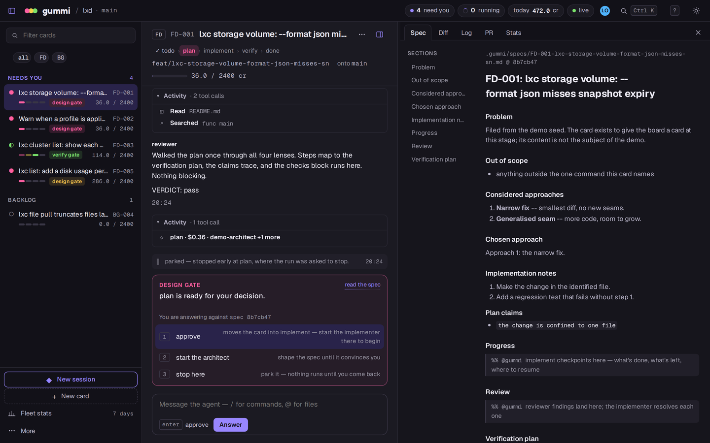

# gummi

> A meta-harness for coding agents. Drive a fleet of agents through a
> spec-driven workflow across git worktrees, from one board or headlessly
> from your own agents and CI.


One coding agent is a pair programmer. Five are a management problem: a
pile of terminals, worktrees you keep straight in your head, and an agent
that has been silently waiting on a question for twenty minutes.

gummi replaces the pile of terminals with one board. Every piece of work
is a card with its own git worktree and branch, and every card walks the
same fixed workflow:

```
todo → plan → implement → verify → done
```

Each stage is done by an agent whose model you choose. gummi's job ends at
a **verified branch** — landing it on main is always your keypress.

## Features

- **One board for many agents** — every card runs in parallel on its own
  worktree and branch; anything that needs you lands in a single inbox.
- **A quality floor you can't configure away** — no implementation without
  an approved plan, no merge without review and verification.
- **Spec-driven** — the plan is a markdown spec on the branch, and it, not a
  transcript, carries context between stages.
- **Pick the model per role** — architect, implementer, reviewer and scribe
  map to models through profiles: strong ones where they earn it, cheap or
  local ones elsewhere. Each card spends from a budget in dollars.
- **Features, bugs, research and goals** — one graph for every kind; a goal
  runs a set of cards toward an outcome under one budget.
- **Attended or autopilot** — approve every gate yourself, or let a card
  drive itself to a verified branch.
- **Freeform sessions** — a single agent in its own worktree, no stages,
  for work that doesn't need a design.
- **Stacks, adopted branches and PRs** — slice a feature into stacked
  branches, or pick up a branch or pull request gummi didn't cut.
- **Headless** — `gummi run` drives a card from scripts, CI or another
  agent, with NDJSON output and typed exit statuses.
- **In the browser** — `gummi web` serves the same board to a browser,
  over loopback or your tailnet.
- **Many backends** — Copilot CLI (default), Claude Code, Codex, opencode,
  pi, Antigravity, or any binary speaking a small stdio protocol.

## Install

gummi is a single binary. There are no releases yet, so install with the
Go toolchain (Go 1.26+):

```sh
go install github.com/morphis/gummi/cmd/gummi@latest
```

or build from a clone:

```sh
git clone https://github.com/morphis/gummi
cd gummi
make build        # → bin/gummi
```

You also need at least one agent backend installed and logged in. The
default is the GitHub Copilot CLI:

```sh
curl -fsSL https://gh.io/copilot-install | bash
```

`gummi doctor` checks that the backend, auth and profiles are ready.

## Usage

Run it inside a git repository:

```sh
cd your-repo
gummi
```

The first run creates a gitignored `.gummi/` with state, a starter
`config.yaml` and `profiles.yaml`. Then:

1. `n` — describe a new card. The first line is the title.
2. `enter` — open it and design it with the architect in its thread.
3. `g` — approve the plan; the implementer starts in the card's worktree.
4. `d` — watch the diff; `b` bounces the work back with your notes.
5. `m` — once verified, squash-merge it into main (or `h` to hand the
   branch off).

The keys you need first:

| key | does |
|---|---|
| `n` | new card |
| `enter` | open the selected card |
| `g` | start the next stage / approve the plan |
| `d` | the card's diff |
| `b` | bounce the work back with your notes |
| `m` / `h` | squash-merge into main / hand the branch off |
| `?` | the full key table |

Headless, with nobody at the keyboard:

```sh
gummi run --envelope 5 "Add a --format=json flag to the export command"
gummi skill install   # teach your own coding agent to drive gummi
```

In a browser:

```sh
gummi web             # http://127.0.0.1:7878, prints a pairing code
```



## Documentation

- [docs/HEADLESS.md](docs/HEADLESS.md) — the headless driver: verbs, exit
  statuses, goals, landing through a PR.
- [docs/CONFIGURATION.md](docs/CONFIGURATION.md) — backends, config files,
  hooks, environment variables, the web host.
- [docs/DESIGN.md](docs/DESIGN.md) — the design and its binding decisions.

## Development

```sh
make build   # build bin/gummi
make test    # run all tests
make ci      # build + test + lint
make demo    # a throwaway repo with gummi initialized
```

See [AGENTS.md](AGENTS.md) for the code layout and conventions.

## Security

Please do not report security vulnerabilities in public issues. See
[SECURITY.md](SECURITY.md) for how to report one privately.

## License

gummi is licensed under the [MIT License](LICENSE).
