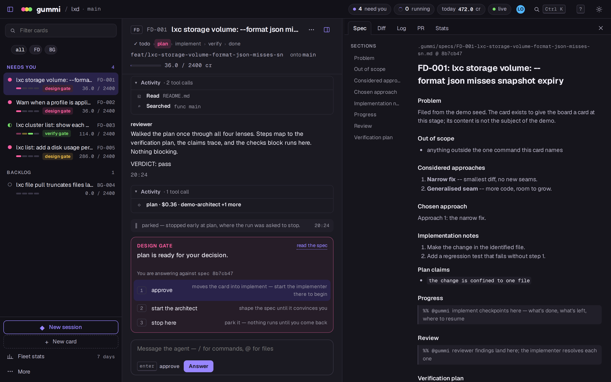

# gummi

**Run a fleet of coding agents from one board in your browser.**



```sh
gummi web        # http://127.0.0.1:7878 — pair your browser, phone or tablet
```

Every piece of work gets its own agent, worktree and branch. You talk to
them, read their diffs and land what you like — from one page, not a pile
of terminals. Each session spends from a dollar budget you set: when it
runs out, the work pauses for your top-up and never overspends.

## Sessions

A session is a coding agent on a git worktree and branch of its own. Run
as many as you like side by side; anything waiting on you lands in one
**Needs you** inbox. Read the diff, comment on lines, then merge or open
a PR — it lands only when you say so.

## Agents

An agent is a session with a home of its own instead of a repository —
a standing assistant for research, triage or ops. Sessions and agents
can come back on a schedule or a heartbeat, and an agent can **watch**:
a schedule you allow runs a cheap command check, and only when it finds
something does a model start work in a repository you named.

## Dynamic workflows

When the work deserves more than one agent, a session writes a spec and
proposes a **workflow**: design, build, review and validate, each step a
fresh agent in the session's own tree, in sequence, in parallel or in a
loop until the checks pass. You allow the run, follow every step live,
and revert it in one click. Recipes are plain YAML — use the bundled
`deliver`, `investigate` and `fix-until-green`, or write your own.

## And also

- **Your models, per role** — Copilot CLI, Claude Code or opencode; the
  session and each workflow role (planner, implementer, reviewer, …) pick
  a model from a profile you edit on the board: a strong one where it
  earns it, a cheap one elsewhere.
- **Anywhere** — loopback or your tailnet (`gummi web --tailscale`),
  with push notifications.
- **Across repositories** — a session may attach other repositories of
  the workspace: the same branch in each, landed one repository at a
  time, one pull request each.
- **Terminal** — the same board as a TUI (`gummi`).

## Get started

```sh
sudo snap install gummi-agent --edge
export PATH=/snap/gummi-agent/current/bin:$PATH
curl -fsSL https://gh.io/copilot-install | bash   # or Claude Code / opencode
cd your-repo && gummi doctor && gummi web
```

Run the binary from `/snap/gummi-agent/current/bin/gummi` directly, not
through the `gummi-agent.gummi` wrapper: the snap is strictly confined,
and gummi needs your repositories, your agents' CLIs and their logins.
Without snap, `go install github.com/morphis/gummi/cmd/gummi@latest`
(Go 1.26+).

Prefer the terminal? Run `gummi` in the repo; `?` shows every key.

## Docs

[Configuration](docs/CONFIGURATION.md) ·
[Design](docs/DESIGN.md) ·
[Contributing](AGENTS.md) ·
[Security](SECURITY.md) ·
[MIT License](LICENSE)
